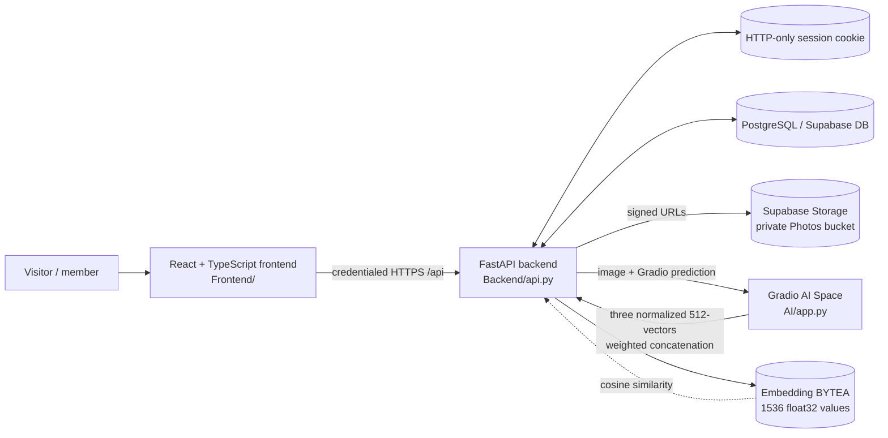
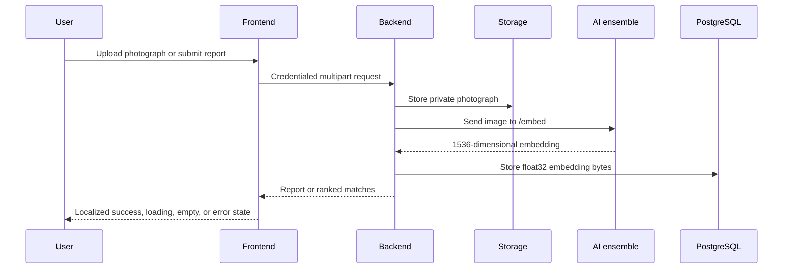
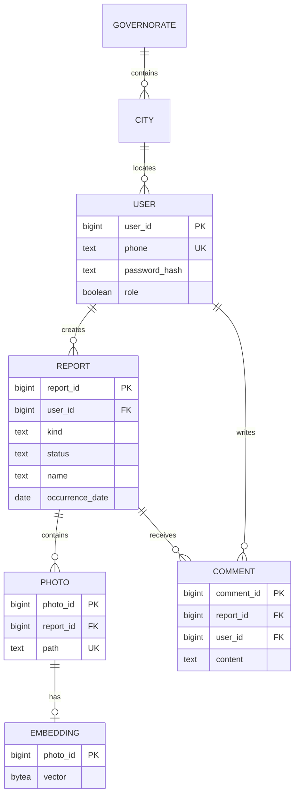

# Reunite

Reunite is a community-led missing-person and found-person reporting platform. It gives families, neighbors, and volunteers a careful place to publish reports, discover active cases, discuss verified details, and search photographs for possible matches.

The system is split into four responsibilities:

| Area          | Responsibility                                                                       | Publicly exposed?       |
| ------------- | ------------------------------------------------------------------------------------ | ----------------------- |
| `Frontend/` | Public website, authenticated member workspace, Arabic localization, RTL UI          | Yes                     |
| `Backend/`  | Authentication, authorization, reports, comments, uploads, storage, AI orchestration | Yes, through`/api`    |
| `AI/`       | Gradio image-embedding service using a three-model ensemble                          | Service-to-service only |
| `Database/` | PostgreSQL schema for users, reports, photos, embeddings, and comments               | No                      |

## Architecture



### Request and matching flow



For photo search, the backend compares vectors using cosine similarity, keeps results at or above `0.23`, sorts them descending, and returns at most five matches. Similarity is an investigation aid, not proof of identity.

## Repository map

```text
Reunite/
├── Frontend/
│   ├── src/
│   │   ├── App.tsx              # Routes, pages, reusable UI, member flows
│   │   ├── lib/api.ts           # Typed frontend-to-backend requests
│   │   ├── lib/i18n.ts          # English/Arabic copy and RTL translation layer
│   │   ├── types.ts             # Frontend domain types
│   │   ├── index.css            # Base design system
│   │   ├── responsive.css       # Tablet/mobile layout rules
│   │   └── mobile-tweaks.css    # Small-screen refinements
│   ├── public/                  # Static assets
│   ├── vite.config.ts           # Vite and @/* source alias
│   └── package.json
├── Backend/
│   ├── api.py                   # FastAPI application and orchestration
│   ├── .env.example             # Server-only configuration template
│   └── README.md                # Backend operational notes
├── AI/
│   ├── app.py                   # Ensemble embedding service
│   └── README.md                # AI service guide; maintained independently
├── Database/
│   └── schema.sql               # PostgreSQL/Supabase schema
└── README.md                    # System-level guide
```

## Product flows

### Public experience

- Landing page with project overview and active-case preview.
- About and support pages.
- English/Arabic language switch with LTR/RTL document direction.
- Sign-in and account registration.

### Authenticated members

- Browse and filter active missing and found reports.
- Create reports with person details, map location, description, and photographs.
- Edit or close owned reports and upload additional photographs.
- Search active cases by photograph.
- View controlled contact details and add community notes.
- Review personal reports and update profile/password settings.

### Administrators

- Manage users and administrator access.
- Create, edit, and delete users.
- Use application-level confirmation dialogs for destructive actions, backed by server-side authorization.

## AI embedding contract

| Model         | Component size | Weight |
| ------------- | -------------: | -----: |
| Buffalo       |            512 |   0.40 |
| Antelope      |            512 |   0.35 |
| AgeDB/Siamese |            512 |   0.25 |

Each output is normalized, weighted, and concatenated into one 1536-dimensional vector. The backend validates the exact dimension, finite numeric values, and stores the vector as `float32` bytes.

Embeddings generated with the previous 512-dimensional contract are incompatible with the current 1536-dimensional contract. Regenerate stored embeddings after an embedding-contract change.

## Data model



Run `Database/schema.sql` against PostgreSQL/Supabase before starting the backend. Foreign keys and cascading deletes keep report-owned photos, embeddings, and comments consistent.

## Local development

### Prerequisites

- Node.js 18+ and npm.
- Python 3.11+.
- PostgreSQL/Supabase and a `Photos` Storage bucket.
- A configured Gradio/Hugging Face AI Space.

### Configure and run

1. Run `Database/schema.sql` against the development database.
2. Copy `Backend/.env.example` to `Backend/.env` and fill in database, JWT, Supabase, CORS, and AI settings:

   ```env
   AI_SPACE=owner/space-name
   AI_TOKEN=server-only-token
   AI_API_NAME=/embed
   EMBEDDING_DIM=1536
   ```
3. Start the backend from the repository root:

   ```powershell
   python -m uvicorn Backend.api:app --reload --port 8080
   ```
4. Copy `Frontend/.env.example` to `Frontend/.env`, set `VITE_API_URL=http://localhost:8080/api`, and start the frontend:

   ```powershell
   cd Frontend
   npm install
   npm run dev
   ```
5. Start the AI service using the instructions in `AI/README.md`. This root README does not modify that document.

The API normally runs at `http://localhost:8080/api`; Vite normally runs at `http://localhost:5173`.

## Validation

```powershell
cd Frontend
npm run typecheck
npm run lint
npm run build
cd ..
python -m py_compile Backend/api.py
```

Browser QA should cover English and Arabic, LTR and RTL, desktop/tablet/mobile widths, registration, login, report CRUD, uploads, photo search, comments, delete confirmation, loading states, empty states, and API errors.

## API surface

| Group                      | Purpose                                                       |
| -------------------------- | ------------------------------------------------------------- |
| `/auth/*`                | Signup, login, logout, and sessions                           |
| `/me`                    | Current account, profile, password, and owned reports         |
| `/reports`               | Report listing, details, creation, updates, close, and delete |
| `/reports/{id}/comments` | Read and create community notes                               |
| `/search/photo`          | Photo-based active-case matching                              |
| `/embeddings/*`          | Embedding generation, storage, and lower-level search         |
| `/admin/users`           | Administrator-only user CRUD                                  |
| `/governorates/*`        | Registration location data                                    |

All browser requests use credentialed cookies. Hiding a frontend button is not an authorization boundary; ownership and administrator checks belong in the backend.

## Security and privacy

- Sessions use HTTP-only cookies.
- Production cross-origin cookies require secure settings.
- CORS must list the exact frontend origin.
- Passwords are hashed with bcrypt.
- Database, service-role, AI, and JWT secrets remain server-side.
- Photos are private and exposed through signed URLs.
- Phone numbers are revealed only through explicit interaction.
- AI similarity results are possibilities for human review, not identity decisions.

## Competition brief

### The problem

When someone goes missing, useful information is often scattered across private conversations, social posts, paper notices, and disconnected organizations. Families need a trusted way to publish structured information. Communities need a simple way to contribute without exposing sensitive contact details. Volunteers need a focused way to compare new information with active cases.

### The solution

Reunite turns that fragmented process into one respectful workflow:

```text
Report → Protect → Discover → Discuss → Reconnect
```

Every report has a clear owner, structured facts, a location, optional photographs, and a controlled conversation space. AI-assisted photo search helps surface possible relationships across active reports, while the final decision remains with people who can verify the situation.

### Why this approach matters

- **Human-centered:** calm language, clear next steps, and thoughtful empty/error states support an emotionally difficult task.
- **Useful structure:** consistent fields make reports searchable instead of burying key details in free-form posts.
- **Responsible AI:** similarity is presented as a lead, never as an automated identity decision.
- **Privacy-aware:** private storage, signed image access, HTTP-only sessions, ownership checks, and controlled phone disclosure reduce unnecessary exposure.
- **Accessible by design:** English and Arabic are supported, including RTL layout behavior and mobile interaction refinements.

## Demonstration narrative

A strong product demonstration follows one continuous story:

1. A visitor opens Reunite and understands the purpose without onboarding.
2. The visitor creates an account using a phone number, password, governorate, and city.
3. The member publishes a missing-person or found-person report with a photograph and map location.
4. The report appears in the community archive with its status and essential facts visible at a glance.
5. Another member searches by photograph. The AI service generates a 1536-value ensemble embedding, and the backend returns the highest-scoring active possibilities.
6. Members review a possible match, add a verified community note, or reveal contact information intentionally.
7. The report owner closes the case when the situation is resolved.
8. An administrator can manage accounts while destructive actions remain explicitly confirmed.

This demonstrates the complete product loop: contribution, discovery, responsible review, and resolution.

## Technical decisions

### Frontend

The frontend is a Vite-powered React and TypeScript application. `App.tsx` owns the route-level experience and reusable interface components, while `lib/api.ts` keeps HTTP behavior in one place. CSS is organized around a shared visual system with dedicated responsive layers for tablet and mobile widths.

The frontend keeps the public API response shape stable. Report normalization happens at the boundary so pages work with consistent `Report` objects even when backend field names differ.

### Backend

The backend is a FastAPI application organized as the trust boundary. It owns session creation, authorization, report lifecycle rules, comments, signed media access, AI calls, embedding validation, and similarity ranking. PostgreSQL provides durable relational state, while Supabase Storage holds private photographs.

The backend validates the embedding contract before storing or comparing vectors. A vector must have the configured dimension (`1536`), contain finite numeric values, and have the same shape as the query vector before cosine similarity is calculated.

### AI ensemble

The AI service combines three complementary face representations:

```text
Buffalo        512 values × 0.40 ┐
Antelope       512 values × 0.35 ├─ normalized weighted concatenation → 1536 values
AgeDB/Siamese  512 values × 0.25 ┘
```

The ensemble is transparent: each model contributes a known portion of the final representation, and the backend performs final ranking. The current default similarity threshold is `0.23`, with the five strongest qualifying results returned to the interface.

### Data and privacy

The schema separates accounts, reports, photographs, embeddings, and comments. Foreign keys preserve ownership relationships, and cascading deletion removes report-owned media and derived embeddings with the report. Photographs are stored privately and displayed through signed URLs rather than public bucket paths.

## Quality and resilience

The application treats state as part of the product experience. Pages provide loading states while data is requested, empty states when there is nothing to show, inline errors when an operation fails, and success feedback after profile or report changes. Destructive actions use an application-level confirmation dialog instead of browser-native prompts.

Responsive behavior has been verified across desktop, tablet, and mobile widths. The layout prevents horizontal overflow, preserves card and form content, maintains usable touch targets, and switches between LTR and RTL document direction when Arabic is selected.

Validation commands:

```powershell
cd Frontend
npm run typecheck
npm run lint
npm run build
cd ..
python -m py_compile Backend/api.py
```

## Responsible-use boundaries

Reunite is a discovery and coordination tool, not a law-enforcement identity system. A similarity score indicates that a photograph may deserve human review; it does not establish that two photographs show the same person. Reports should contain information the contributor can verify, and users should avoid publishing unnecessary private details.

Embedding data is version-sensitive. The current service uses 1536-dimensional vectors. Data generated under the former 512-dimensional contract must be regenerated before it can participate in current similarity searches.

## Future direction

The architecture leaves room for high-value extensions without changing the core trust boundary: verified organization accounts, case-specific moderation and audit history, typed translation resources, background embedding jobs, threshold evaluation dashboards, authorized notifications, and stronger automated accessibility coverage.

## Project documentation map

- This document explains the complete system, product reasoning, and competition narrative.
- `Backend/README.md` contains backend-specific operational notes.
- `AI/README.md` remains the authoritative guide for the independent AI service and is intentionally not modified by root documentation work.
- `Frontend/README.md` contains frontend package notes.
- `Database/schema.sql` is the source of truth for the relational schema.

## Engineering principles

- Keep presentation and interaction in `Frontend/src`, API request details in `Frontend/src/lib/api.ts`, and authorization in `Backend/api.py`.
- Preserve public API response shapes when changing internal implementation details.
- Treat embedding dimensions and thresholds as explicit compatibility settings.
- Add new user-facing copy to the localization dictionaries.
- Prefer confirmed destructive actions and clear loading, error, and empty states.
