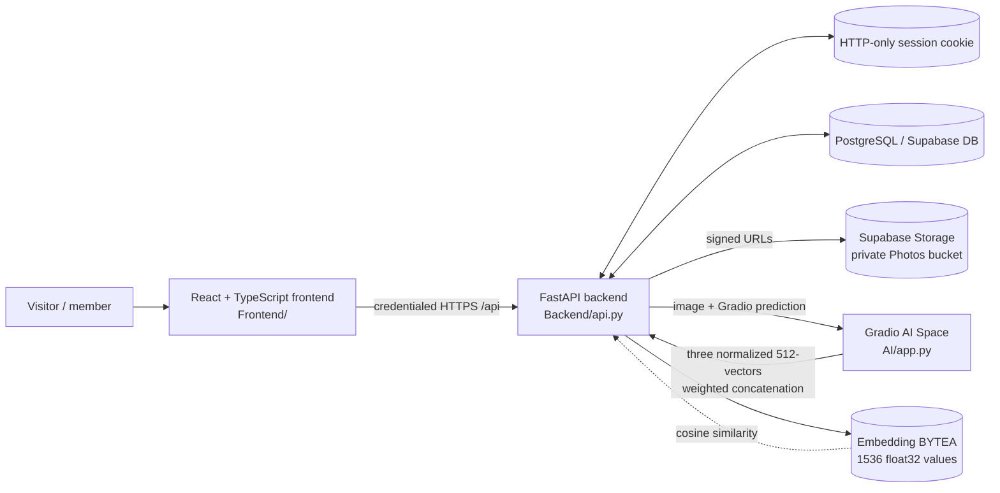
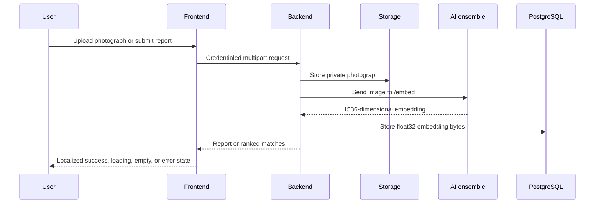
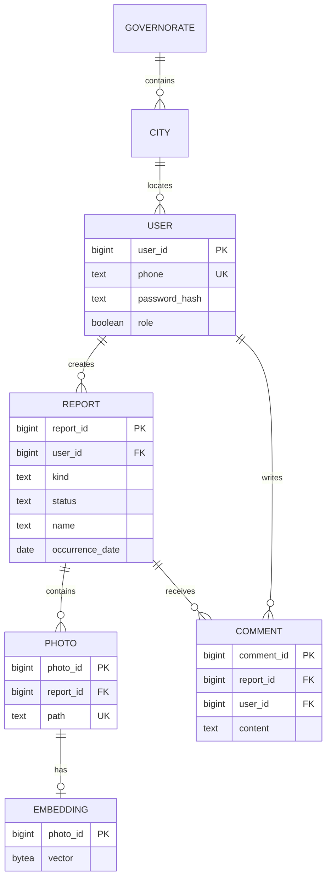

# Reunite

Reunite is a community-led missing-person and found-person reporting platform. It gives families, neighbors, and volunteers a careful place to publish reports, discover active cases, discuss verified details, and search photographs for possible matches.

The system is split into four responsibilities:

| Area | Responsibility | Publicly exposed? |
| --- | --- | --- |
| `Frontend/` | Public website, authenticated member workspace, Arabic localization, RTL UI | Yes |
| `Backend/` | Authentication, authorization, reports, comments, uploads, storage, AI orchestration | Yes, through `/api` |
| `AI/` | Gradio image-embedding service using a three-model ensemble | Service-to-service only |
| `Database/` | PostgreSQL schema for users, reports, photos, embeddings, and comments | No |

## Architecture



### Request and matching flow



For photo search, the backend compares vectors using cosine similarity, keeps results at or above `0.20`, sorts them descending, and returns at most five matches. Similarity is an investigation aid, not proof of identity.

## Repository map

```text
Reunite/
├── Frontend/
│   ├── src/
│   │   ├── App.tsx              # Routes, pages, reusable UI, member flows
│   │   ├── lib/api.ts           # Typed frontend-to-backend requests
│   │   ├── lib/i18n.ts          # English/Arabic copy and RTL translation layer
│   │   ├── types.ts             # Frontend domain types
│   │   ├── index.css            # Base design system
│   │   ├── responsive.css       # Tablet/mobile layout rules
│   │   └── mobile-tweaks.css    # Small-screen refinements
│   ├── public/                  # Static assets
│   ├── vite.config.ts           # Vite and @/* source alias
│   └── package.json
├── Backend/
│   ├── api.py                   # FastAPI application and orchestration
│   ├── .env.example             # Server-only configuration template
│   └── README.md                # Backend operational notes
├── AI/
│   ├── app.py                   # Ensemble embedding service
│   └── README.md                # AI service guide; maintained independently
├── Database/
│   └── schema.sql               # PostgreSQL/Supabase schema
└── README.md                    # System-level guide
```

## Product flows

### Public experience

- Landing page with project overview and active-case preview.
- About and support pages.
- English/Arabic language switch with LTR/RTL document direction.
- Sign-in and account registration.

### Authenticated members

- Browse and filter active missing and found reports.
- Create reports with person details, map location, description, and photographs.
- Edit or close owned reports and upload additional photographs.
- Search active cases by photograph.
- View controlled contact details and add community notes.
- Review personal reports and update profile/password settings.

### Administrators

- Manage users and administrator access.
- Create, edit, and delete users.
- Use application-level confirmation dialogs for destructive actions, backed by server-side authorization.

## AI embedding contract

| Model | Component size | Weight |
| --- | ---: | ---: |
| Buffalo | 512 | 0.40 |
| Antelope | 512 | 0.35 |
| AgeDB/Siamese | 512 | 0.25 |

Each output is normalized, weighted, and concatenated into one 1536-dimensional vector. The backend validates the exact dimension, finite numeric values, and stores the vector as `float32` bytes.

Embeddings generated with the previous 512-dimensional contract are incompatible with the current 1536-dimensional contract. Regenerate stored embeddings after an embedding-contract change.

## Data model



Run `Database/schema.sql` against PostgreSQL/Supabase before starting the backend. Foreign keys and cascading deletes keep report-owned photos, embeddings, and comments consistent.

## Local development

### Prerequisites

- Node.js 18+ and npm.
- Python 3.11+.
- PostgreSQL/Supabase and a `Photos` Storage bucket.
- A configured Gradio/Hugging Face AI Space.

### Configure and run

1. Run `Database/schema.sql` against the development database.
2. Copy `Backend/.env.example` to `Backend/.env` and fill in database, JWT, Supabase, CORS, and AI settings:

   ```env
   AI_SPACE=owner/space-name
   AI_TOKEN=server-only-token
   AI_API_NAME=/embed
   EMBEDDING_DIM=1536
   ```

3. Start the backend from the repository root:

   ```powershell
   python -m uvicorn Backend.api:app --reload --port 8080
   ```

4. Copy `Frontend/.env.example` to `Frontend/.env`, set `VITE_API_URL=http://localhost:8080/api`, and start the frontend:

   ```powershell
   cd Frontend
   npm install
   npm run dev
   ```

5. Start the AI service using the instructions in `AI/README.md`. This root README does not modify that document.

The API normally runs at `http://localhost:8080/api`; Vite normally runs at `http://localhost:5173`.

## Validation

```powershell
cd Frontend
npm run typecheck
npm run lint
npm run build
cd ..
python -m py_compile Backend/api.py
```

Browser QA should cover English and Arabic, LTR and RTL, desktop/tablet/mobile widths, registration, login, report CRUD, uploads, photo search, comments, delete confirmation, loading states, empty states, and API errors.

## API surface

| Group | Purpose |
| --- | --- |
| `/auth/*` | Signup, login, logout, and sessions |
| `/me` | Current account, profile, password, and owned reports |
| `/reports` | Report listing, details, creation, updates, close, and delete |
| `/reports/{id}/comments` | Read and create community notes |
| `/search/photo` | Photo-based active-case matching |
| `/embeddings/*` | Embedding generation, storage, and lower-level search |
| `/admin/users` | Administrator-only user CRUD |
| `/governorates/*` | Registration location data |

All browser requests use credentialed cookies. Hiding a frontend button is not an authorization boundary; ownership and administrator checks belong in the backend.

## Security and privacy

- Sessions use HTTP-only cookies.
- Production cross-origin cookies require secure settings.
- CORS must list the exact frontend origin.
- Passwords are hashed with bcrypt.
- Database, service-role, AI, and JWT secrets remain server-side.
- Photos are private and exposed through signed URLs.
- Phone numbers are revealed only through explicit interaction.
- AI similarity results are possibilities for human review, not identity decisions.

## Deployment checklist

- [ ] Run the current `Database/schema.sql`.
- [ ] Verify the AI `/embed` endpoint returns 1536 values.
- [ ] Set backend `EMBEDDING_DIM=1536`.
- [ ] Set a strong production `JWT_SECRET`.
- [ ] Configure exact `FRONTEND_URL` and secure cookie settings.
- [ ] Configure Supabase Storage and server-only credentials.
- [ ] Set frontend `VITE_API_URL` to the deployed API.
- [ ] Rebuild and deploy the frontend.
- [ ] Regenerate old embeddings after an embedding-contract change.
- [ ] Test authentication, CRUD, uploads, search, comments, deletion, Arabic RTL, and mobile layouts.
- [ ] Confirm no secrets are committed.

## Engineering conventions

- Keep presentation and interaction in `Frontend/src`, API request details in `Frontend/src/lib/api.ts`, and authorization in `Backend/api.py`.
- Preserve public API response shapes when changing internals.
- Treat embedding dimensions and thresholds as explicit compatibility settings.
- Add new user-facing copy to the localization dictionaries.
- Prefer confirmed destructive actions and clear loading/error/empty states.
- Do not edit `AI/README.md` from root-level documentation changes.
